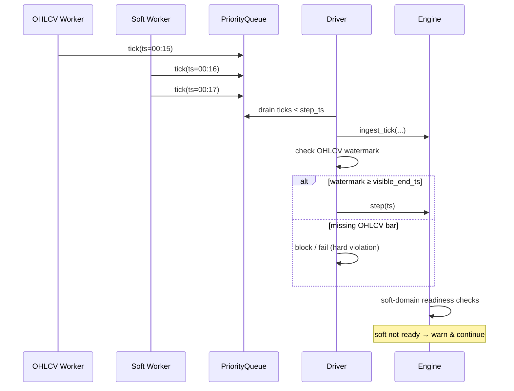
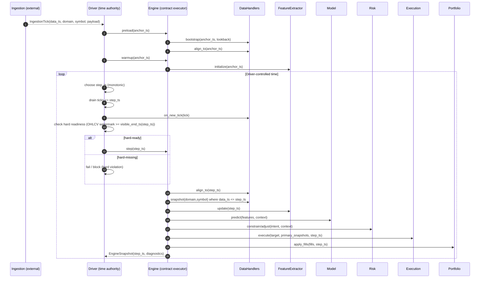

# SoionLab

[](https://github.com/ZBaiY/SoionLab/actions/workflows/ci.yml?query=branch%3Amain)


## Overview
SoionLab is a contract-driven research engine designed for studying time-dependent, execution-constrained systems in a reproducible way.

It provides a unified runtime semantics across Backtest, Mock (paper), and Live modes, treating time, lifecycle, and execution constraints as first-class research objects rather than implementation details.

At its core, SoionLab enforces explicit contracts (via Protocols) between components, while the runtime guarantees time consistency and execution realism across modes.

### Core design principles
- Strategies are defined as static templates: no mode, no time, no side effects.
- Concrete symbols are resolved through an explicit bind step.
- The Driver (Backtest / Mock / Realtime) acts as the single source of time and lifecycle authority.

## Environment compatibility

Tested research environments:

- **OS**: Ubuntu 22.04 LTS (x86_64), macOS (Apple Silicon)
- **Python**: 3.11, 3.12

Continuous integration is maintained via GitHub Actions
(`.github/workflows/ci.yml`).

## Installation

This repository contains a **self-contained runtime instance** used for
research and experimentation.

- Runtime data root: `./data/`
- Runtime artifacts root: `./artifacts/`

All filesystem paths are **repo-root anchored** (no CWD dependence), to ensure
reproducible runtime behavior.

### Quick start (research environment)

The following setup is intended for a controlled research environment
(e.g. personal workstation or VPS used for experiments).

```bash
apt-get update && apt-get install -y curl bzip2
curl -fsSL https://repo.anaconda.com/miniconda/Miniconda3-latest-Linux-x86_64.sh -o /tmp/miniconda.sh
bash /tmp/miniconda.sh -b -p /root/miniconda3
/root/miniconda3/bin/conda init bash
# reopen shell or: source ~/.bashrc

bash scripts/installation.sh
source /root/miniconda3/etc/profile.d/conda.sh
conda activate qe
```

### Alternative (no conda): venv

If you prefer not to use conda:
```bash
cd SoionLab
apt-get update && apt-get install -y python3-venv python3-dev build-essential
python3 -m venv .venv
source .venv/bin/activate
pip install -U pip
pip install -r requirements.txt
pip install -e .
python -c "import quant_engine, ingestion; print('imports_ok')"
```

### Testing

CI runs unit and integration tests **without relying on local or private datasets**.

```bash
pytest -q -m "not local_data" tests
```

Local/private dataset tests are opt-in:
- mark with `@pytest.mark.local_data`
- run with: `pytest -q -m local_data tests`


## Runtime concepts (brief)

- **BoundStrategy**: a fully instantiated strategy with concrete symbols resolved. This is the only form accepted by the runtime.
- **Engine**: the execution semantics layer (time, lifecycle, legality).
- **Driver** (BacktestEngine / MockEngine / RealtimeEngine): the single authority that advances time and triggers `engine.step()`.

Operational notes:
- Secrets (API keys, Telegram bot tokens, etc.) must **not** be committed. Keep them on the server (environment variables or root-only files).
- Ingestion writes append-only parquet under `./data/raw/...` by design.


## From event-driven to contract-driven

Earlier versions relied on implicit control flow between components, which became fragile
under multi-source data and execution constraints.

SoionLab keeps the runtime event-driven, but **logic boundaries are enforced by explicit contracts**:

- `FeatureChannel` → feature emission
- `ModelProto` → score production
- `DecisionProto` → intent generation
- `RiskProto` → target position constraints
- `ExecutionPolicy / Router / Slippage / Matching` → fill realization

Each layer communicates only through its contract.
Cross-layer assumptions are rejected by construction.

---

## Data ingestion as an external boundary

SoionLab deliberately separates data ingestion from the runtime.

Ingestion is treated as an **external subsystem** responsible for:
- fetching, listening to, or replaying data
- normalizing raw inputs into immutable ticks
- optionally persisting data (e.g. parquet)

The runtime **never interacts with data sources**.  
It only consumes **already-normalized ticks** provided by the Driver.

**Hard boundary (single entry point):**
```
WORLD → Ingestion → Tick → Driver → Engine → DataHandler → Feature/Model
```
Key constraints:
- Ingestion may be synchronous or asynchronous and may block on I/O.
- The runtime is single-threaded and strictly **driver-time–controlled**.
- Strategy / Engine / DataHandler never know data provenance.
- The only object crossing the boundary is an immutable `IngestionTick`.

---

## Deterministic replay under async ingestion

This section describes a subtle but fundamental constraint in any
event-driven research system operating under asynchronous data arrival.

The engine uses the **same async ingestion → tick → driver → engine pipeline**
for **backtest, mock, and realtime**.

Because ingestion is concurrent, **tick arrival order never guarantees
domain-level readiness at a given step timestamp**.
Backtest runs faster and exposes this more often, but the issue exists in all modes.

---

## Hard vs soft readiness contracts

### Hard (grid-based domains, e.g. OHLCV)

Bars must be *closed* before they are visible.
```
visible_end_ts(ts) = floor(ts / interval_ms) * interval_ms - 1
```
A step at `ts` is legal **only if**:
```
handler.last_timestamp() ≥ visible_end_ts(ts)
```
All OHLCV handlers (primary and secondary) are subject to this rule.

Violation is treated as a hard failure and indicates missing or inconsistent market data.

This prevents:
- lookahead bias
- race-driven nondeterminism
- scheduling-dependent “one-bar lag”

---

### Soft (non-grid domains: option_chain, iv_surface, sentiment, orderbook, …)

No closed-bar semantics apply.

Soft domains are checked inside `engine.step(ts)`:
- a snapshot exists with `data_ts ≤ ts`
- freshness / coverage constraints (domain-specific)

If not ready:
- the step still executes
- a warning is logged with diagnostics
- no blocking, no exception

(Decision-layer fallbacks such as HOLD or exposure reduction are future work.)

---

## Design trade-off

SoionLab deliberately enforces **one execution logic across backtest, mock, and realtime**.

This sacrifices a small amount of backtest “perfect determinism” for soft domains,
but gains:
- semantic consistency across modes
- realistic failure surfaces
- explicit, auditable data gaps


## Strategy structure vs runtime execution

SoionLab separates **strategy structure** from **runtime execution**.  
A strategy describes *what* the system is, while the runtime defines *when* and *what is legal*.

### 1) Strategy template (static)

A Strategy declares:
- data semantics (domains, intervals, lookbacks)
- feature topology
- model / decision / risk / execution composition

It may contain symbolic placeholders (e.g. `{A}`, `{B}`), but it must be:
- time-agnostic (no timestamps, no clocks)
- state-free (no mutable runtime state)
- data-source blind (no I/O, no handlers)

### 2) Bind (structural resolution)

The bind step resolves placeholders into a concrete universe
(primary / secondary symbols).

Bind is:
- deterministic
- side-effect free
- semantics-preserving (no time, no data, no execution)

Output: a fully specified **BoundStrategy**.

### 3) Loader (wiring, no time)

`StrategyLoader` consumes a BoundStrategy and wires the runtime graph:
- DataHandlers (empty shells + cache contracts; no data yet)
- FeatureExtractor
- Models
- Risk rules
- Execution pipeline
- StrategyEngine (Engine)

After wiring:
- the Engine exists as a *contract executor*
- no data has been observed
- time has not advanced

---

## Runtime control flow: Driver-owned time

The Driver is the **single time authority**.

The Engine is time-agnostic but **time-validated**:
- it never advances time
- it rejects non-monotonic time and lookahead-visible states


# Time ownership & lookahead safety (core invariant)

## Single source of time truth

SoionLab enforces a strict **single-owner time model**.

Only the **Driver / Runner** (BacktestEngine, MockEngine, RealtimeEngine) may:
- decide *when* time advances
- decide *which timestamp* is processed next
- control replay speed, ordering, and stopping conditions

All other layers are **time-agnostic**.

| Layer | Owns time progression? | Responsibility |
|------|-------------------------|----------------|
| Strategy | ❌ | Declare structure and intent only |
| Feature | ❌ (accepts `ts` only) | Snapshot/windowed computation |
| DataHandler | ❌ (`on_new_tick` / `align_to` only) | Cache + anti-lookahead gates |
| StrategyEngine | ❌ (relays `ts` only) | Runtime orchestration |
| **Driver / Runner** | ✅ | **Single time authority** |

## Why this matters: lookahead safety

Lookahead bias is not a modeling bug — it is a **time-ownership bug**.

In SoionLab:
- Strategies never pull data
- Features never advance time
- DataHandlers never decide *when* new data arrives
- The Engine never infers, guesses, or advances timestamps

Every timestamp used for:
- feature computation
- model prediction
- risk sizing
- execution simulation

originates **exclusively** from the Driver.

This enforces:
- deterministic backtests (given identical inputs)
- consistent execution semantics across backtest / mock / realtime
- zero accidental future data access by construction

## Backtest, mock, realtime: same Engine, different Drivers

The Engine (StrategyEngine) is identical across all modes.  
Only the Driver changes:

- **BacktestEngine**: replays historical ticks
- **MockEngine**: advances synthetic or delayed data
- **RealtimeEngine**: advances wall-clock–paced ingestion

Because time ownership is isolated:
- switching modes requires **no strategy changes**
- execution realism is preserved
- research results transfer cleanly

> **Invariant:** If a component does not own time, it must never decide, infer, or advance time.

---

# Runtime pipeline (bar → snapshot → action)

At runtime, each step executes a clean, contract-driven pipeline:

1. DataHandlers expose market snapshots (per-domain, per-symbol; `data_ts ≤ ts`)
2. Features update on `ts` and emit a single feature dict
3. Models produce scores
4. Decision + Risk transform scores into a target position
5. Execution produces fills (same semantics across backtest / mock / realtime)
6. Portfolio + reporting apply fills and update P&L / accounting / traces

Each layer depends only on **contracts**, not implementations.

## Logging & Trace

SoionLab separates **operational logging** from **research-grade tracing**.

**Default logs (`default.jsonl`)**
- Low-frequency, human-facing.
- INFO only for lifecycle transitions and actionable anomalies.
- Normal empty paths (e.g. “no orders”, “not ready”) must not emit INFO.
- Logs never affect runtime behavior.

**Trace logs (`trace.jsonl`, v2)**
- High-frequency, append-only JSONL for step-level alignment.
- One `trace.header` per run; subsequent events include only `ts_ms`, `event`, `run_id`, and event-specific payload.
- Certain decision/execution events include `intent_id` and execution outcome fields to support counterfactual comparison.
- Trace is observational only; runtime must not branch on trace content.

---

## Strategy design (code-first)

SoionLab treats a strategy as a **static template** defined in code.  
You create strategies under `apps/strategy/*.py` and register them via:

```python
@register_strategy("EXAMPLE")
class ExampleStrategy(StrategyBase):
    STRATEGY_NAME = "EXAMPLE"
    INTERVAL = "30m"

    # 1) Universe + readiness policy (what symbols exist, and what data is blocking vs non-blocking)
    UNIVERSE_TEMPLATE = {
        "primary": "{A}",
        "secondary": {"{B}"},
        "soft_readiness": {
            "enabled": False,
            "domains": ["orderbook", "option_chain", "iv_surface", "sentiment"],
            "max_staleness_ms": 300000,
        },
    }

    # 2) Data semantics only (domains + refs), not ingestion
    DATA = {
        "primary": {"ohlcv": {"$ref": "OHLCV_15M_180D"}, "option_chain": {"$ref": "OPTION_CHAIN_5M"}},
        "secondary": {"{B}": {"ohlcv": {"$ref": "OHLCV_15M_180D"}}},
    }
    REQUIRED_DATA = {"ohlcv", "option_chain"}

    # 3) Feature/model/decision/risk/execution wiring (shape only)
    FEATURES_USER = [
        {"name": "SPREAD_MODEL_{A}^{B}", "type": "SPREAD", "symbol": "{A}", "params": {"ref": "{B}"}},
        {"name": "ZSCORE_MODEL_{A}^{B}", "type": "ZSCORE", "symbol": "{A}", "params": {"ref": "{B}", "lookback": 120}},
        {"name": "ATR_RISK_{A}", "type": "ATR", "symbol": "{A}", "params": {"window": "{ATR_WINDOW}"}},
    ]

    MODEL_CFG = {...}
    DECISION_CFG = {...}
    RISK_CFG = {...}
    EXECUTION_CFG = {...}
    PORTFOLIO_CFG = {...} # Choose "FRACTIONAL-CASH-CONSTRAINT" for fractional trading
```
Notes:
- Symbols are declared by UNIVERSE_TEMPLATE + DATA. Features/models may reference symbols but must not introduce new ones.
- Placeholder params (e.g. {window_RSI}) are resolved by the bind step, same as symbols.
- Ingestion config (sources/transports/persistence) is intentionally not part of strategy definition.

## Running a backtest (apps)

To run a strategy, edit `apps/run_backtest.py` and set:
- `STRATEGY_NAME`: a registered strategy name
- `BIND_SYMBOLS`: values for `{A}`, `{B}` and any parameter placeholders used by the strategy
- `START_TS`, `END_TS`: epoch ms (driver-owned)
- `DATA_ROOT`: repo-root anchored path

```python
# apps/run_backtest.py

from quant_engine.utils.paths import data_root_from_file

STRATEGY_NAME = "RSI-ADX-SIDEWAYS-FRACTIONAL"  # switch to "RSI-ADX-SIDEWAYS" to disable fractional
BIND_SYMBOLS = {
    "A": "BTCUSDT",
    "B": "ETHUSDT",
    "ATR_WINDOW": "14",
}

START_TS = 1766966400000    # 2025-12-29 00:00:00 UTC (epoch ms)
END_TS   = 1767052800000    # 2025-12-30 00:00:00 UTC

DATA_ROOT = data_root_from_file(__file__, levels_up=1) # Default data location
```

