<h3 align="center">
  <strong>
    The Quant Engine (TradeBot v4)
  </strong>
</h3>

<p align="center" style="font-size:26px; font-weight:600; line-height:1.35; padding:10px 0;">
  A modular, extensible, execution-realistic research & trading framework —
  designed for professional-grade systematic trading.
</p>

---

# Overview
The Quant Engine (TradeBot v4) is a **contract-driven quantitative trading system** designed to unify:

- **Backtesting**
- **Mock Trading (paper trading with execution realism)**
- **Real-Time Live Trading**
- **Research & Factor Libraries (tradebot-labs)**

under one clean, consistent architecture.

Its purpose is simple:
> Build a reproducible, modular, execution-aware quant research and trading engine comparable to professional quant infrastructure.

This README documents **the major components, principles, pipeline flow, and usage examples**.

---

# Key Architectural Transition: Event-Driven → Contract-Driven
Early versions (TradeBot v2–v3) followed a purely event-driven pipeline:
```
Data → Features → Model → Signal → Strategy → Risk → Order → Execution
```
While functional for early prototypes, this design became fragile when adding:
- sentiment signals
- cross-asset factors
- IV-surface models
- multiple strategies
- realistic execution rules
- slippage & market impact

The system became tightly coupled and difficult to extend.

## v4: Contract-Driven Architecture
Each layer now exposes a **formal Protocol (contract)** that defines *what* it provides, while hiding *how* it is implemented.

Components communicate through contracts only:
- **FeatureChannel** — TA, microstructure, sentiment, IV, vol, cross-asset
- **ModelProto** — transforms features into scores
- **DecisionProto** — transforms scores into trade intents
- **RiskProto** — converts intents into target positions
- **ExecutionPolicy** — converts targets to child orders
- **Router / SlippageModel / MatchingEngine** — unify backtest, mock, and live execution

Runtime remains event-driven, but **logic is cleanly separated and contract-driven**.

---

# System Capabilities
TradeBot v4 supports:

### ✔ **Backtesting**  
- realistic execution (same Execution Layer as live)
- slippage & impact modelling
- TWAP / Immediate / Maker-First execution policies
- multi-asset strategies
- factor and model evaluation
- P&L decomposition & reporting

### ✔ **Mock Trading (Real-Time Execution Simulation)**  
- real-time market data feed
- deterministic or stochastic fill simulation
- same routing, slippage, and rounding as live
- safe dry-run for production strategies

### ✔ **Live Trading**  
- unified execution adapter
- consistent semantics with mock & backtest
- fee-aware integer rounding
- real exchange order routing (Binance)

### ✔ **Feature Engineering Framework**  
- pluggable FeatureChannels
- TA indicators, microstructure, volatility, sentiment, IV surface
- cross-asset factors (DXY, NDX, ETH → BTC)
- rolling & windowed computation

### ✔ **Modeling Framework**  
- Statistical models (RSI, MACD, OU)
- ML models
- Sentiment-aware models
- IV-surface-driven volatility models

### ✔ **Decision Layer**  
- threshold / regime-based decision
- sentiment gating
- ensemble decision rules

### ✔ **Risk Layer**  
- ATR-based sizing
- vol-adjusted sizing
- sentiment-scaled sizing
- portfolio exposure constraints

### ✔ **Execution Layer** (core of v4)
- ExecutionPolicy (Immediate, TWAP, Maker-First)
- Router (passive/agg routing)
- SlippageModel (linear, depth-aware)
- MatchingEngine (Backtest = Mock = Live semantics)

### ✔ **Portfolio Engine**
- unified state update
- P&L, leverage, position accounting

### ✔ **Reporting Engine**
- performance report
- factor attribution
- implementation shortfall (IS)
- sentiment regime attribution

---

# How a Market Bar Flows Through the Quant Engine (v4)
At runtime, each new market bar triggers a clean, contract-driven pipeline:

1. **Feature Channels** compute TA, microstructure, sentiment, IV, cross-asset factors
2. **ModelProto** outputs a continuous score
3. **DecisionProto** converts scores into trade intents
4. **RiskProto** determines target position & constraints
5. **ExecutionPolicy** generates child orders
6. **Router** performs passive vs aggressive selection
7. **SlippageModel** applies impact & fee adjustments
8. **MatchingEngine** produces fills (Backtest = Live)
9. **Portfolio Engine** updates state & P&L
10. **Reporting Engine** logs IS, performance, attribution

Each layer depends **only on contracts**, not implementations.

---

# Minimal Strategy Configuration Example (v4 JSON)
```json
{
  "BTCUSDT": {
    "strategy": {
      "model": {
        "class": "RSIModel",
        "params": { "window": 14 }
      },
      "decision": {
        "class": "ThresholdDecision",
        "params": { "threshold": 0.0 }
      },
      "risk": {
        "class": "ATRSizer",
        "params": { "atr_window": 14, "risk_fraction": 0.02 }
      },
      "execution": {
        "class": "TWAPPolicy",
        "params": { "segments": 5 }
      }
    }
  }
}
```
This JSON assembles components — it does **not** select branches inside a pipeline.

---

# Minimal Working Example (Python)
```python
from quant_engine import (
    RSIModel,
    ThresholdDecision,
    ATRSizer,
    TWAPPolicy,
    StrategyEngine,
)

strategy = StrategyEngine(
    model=RSIModel(window=14),
    decision=ThresholdDecision(threshold=0.0),
    risk=ATRSizer(atr_window=14, risk_fraction=0.02),
    execution=TWAPPolicy(segments=5),
)

strategy.backtest(
    symbol="BTCUSDT",
    start="2022-01-01",
    end="2023-01-01"
)

strategy.report.save("reports/btc_rsi_twap/")
```

---

# Why This Architectural Shift Matters
It enables the Quant Engine to gracefully support:
- ML-based sentiment regimes
- microstructure-aware execution
- IV-surface-derived features (SABR / SSVI)
- volatility forecasting
- multi-asset & cross-asset strategies
- execution-realistic mock trading
- reproducible backtests with live parity
- research & execution decoupled but interoperable

---

# Full System Architecture Diagram

```mermaid
flowchart TD

%% ==========================================================
%% LAYER 0 — DATA SOURCES
%% ==========================================================

subgraph L0[Layer 0 — Data Sources]
    MKT[Market Data<br>Binance Klines<br>Orderbook L1 L2<br>Trades]
    ALT[Alternative Data<br>News<br>Twitter X<br>Reddit]
    OPT[Derivatives Data<br>Option Chains<br>IV Surface<br>OU Model]
end


%% ==========================================================
%% LAYER 1 — DATA INGESTION
%% ==========================================================

subgraph L1[Layer 1 — Data Ingestion]
    HDH[HistoricalDataHandler<br>clean check rescale]
    RTDH[RealTimeDataHandler<br>stream bars<br>update windows]
    SLOAD[SentimentLoader<br>fetch news tweets<br>cache dedupe]
end

MKT --> HDH
MKT --> RTDH
ALT --> SLOAD
OPT --> HDH


%% ==========================================================
%% LAYER 2 — FEATURE LAYER
%% ==========================================================

subgraph L2[Layer 2 — Feature Layer]
    FE[FeatureExtractor<br>TA indicators<br>Microstructure<br>Vol indicators<br>IV factors]
    SENTPIPE[SentimentPipeline<br>text cleaning<br>FinBERT VADER fusion<br>sentiment score vol velocity]
    MERGE[Merge Features<br>TA + microstructure + vol + sentiment]
end

HDH --> FE
RTDH --> FE
SLOAD --> SENTPIPE
FE --> MERGE
SENTPIPE --> MERGE


%% ==========================================================
%% LAYER 3 — MODELING LAYER
%% ==========================================================

subgraph L3[Layer 3 — Modeling Layer ModelProto]
    MODEL[Model Library<br>Statistical<br>ML models<br>Regime classifier<br>Physics OU models]
end

MERGE --> MODEL


%% ==========================================================
%% LAYER 4 — DECISION LAYER
%% ==========================================================

subgraph L4[Layer 4 — Decision Layer DecisionProto]
    DECIDE[Decision Engine<br>Signal + sentiment regime fusion<br>Threshold gating]
end

MODEL --> DECIDE
SENTPIPE --> DECIDE


%% ==========================================================
%% LAYER 5 — RISK LAYER
%% ==========================================================

subgraph L5[Layer 5 — Risk Layer RiskProto]
    RISK[Risk Engine<br>SL TP<br>ATR volatility<br>Sentiment scaled size<br>Portfolio exposure]
end

DECIDE --> RISK
SENTPIPE --> RISK


%% ==========================================================
%% LAYER 6 — EXECUTION LAYER
%% ==========================================================

subgraph L6[Layer 6 — Execution Layer]
    POLICY[ExecutionPolicy<br>Immediate<br>TWAP<br>Maker first]
    ROUTER[Router<br>L1 L2 aware<br>timeout rules]
    SLIP[SlippageModel<br>Linear impact<br>Depth model]
    MATCH[MatchingEngine<br>Backtest = Live]
end

RISK --> POLICY
POLICY --> ROUTER
ROUTER --> SLIP
SLIP --> MATCH


%% ==========================================================
%% LAYER 7 — PORTFOLIO UPDATE
%% ==========================================================

subgraph L7[Portfolio and Accounting]
    PORT[Portfolio Manager<br>positions<br>PnL<br>leverage<br>exposures]
end

MATCH --> PORT


%% ==========================================================
%% LAYER 8 — REPORTING
%% ==========================================================

subgraph L8[Reporting Engine]
    REPORT[Reporting<br>Backtest metrics<br>IS Slippage<br>Factor exposure<br>Sentiment regime attribution]
end

PORT --> REPORT
DECIDE --> REPORT
RISK --> REPORT
SENTPIPE --> REPORT
```

