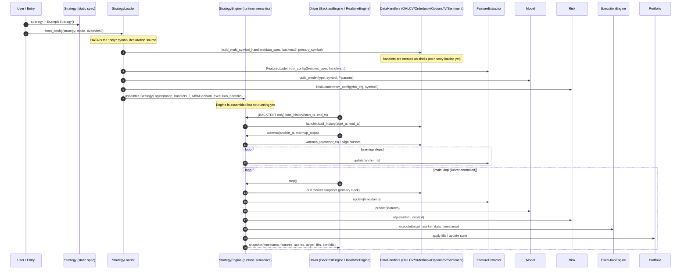
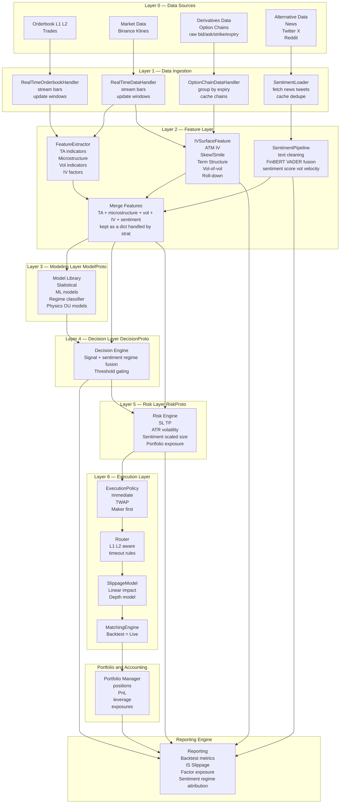

<h1 align="center">
  <strong>
    The Quant Engine (TradeBot v4)
  </strong>
</h1>

<p align="center" style="font-size:26px; font-weight:600; line-height:1.35; padding:10px 0;">
  A modular, extensible, execution-realistic research & trading framework —
  designed for professional-grade systematic trading.
</p>

---

# Overview
Quant Engine (TradeBot v4) is a **contract-driven quant research & execution framework** with **one unified runtime semantics** across:
- **Backtest**
- **Mock (paper) trading**
- **Live trading**

Core idea: components communicate through explicit contracts (Protocols), while the runtime enforces **time/lifecycle correctness** and **execution realism**.

**Design rules (non-negotiable):**
- **Strategy** = static specification (what to run). No mode, no time, no side effects.
- **Engine** = runtime semantics (time, lifecycle, legality).
- **Driver** (BacktestEngine / RealtimeEngine) = time pusher (calls `engine.step()`), strategy-agnostic.

## Event-driven → Contract-driven
Earlier versions chained logic directly (Data → Features → Model → Decision → Risk → Execution), which became fragile with multi-source data and execution realism.

v4 keeps the runtime event-driven, but **logic boundaries are enforced by contracts**:
- `FeatureChannel` → features
- `ModelProto` → scores
- `DecisionProto` → intents
- `RiskProto` → target positions
- `ExecutionPolicy/Router/Slippage/Matching` → fills

## Strategy loading and runtime control-flow



---

# How a Market Bar Flows Through the Quant Engine (v4)
At runtime, each new market bar triggers a clean, contract-driven pipeline:

1. Handlers provide the current market snapshot (multi-source)
2. Features are computed and merged into a single feature dict
3. Models output scores
4. Decision + Risk convert scores into a target position
5. Execution layer produces fills (same semantics across backtest/mock/live)
6. Portfolio + reporting update P&L / accounting / traces

Each layer depends **only on contracts**, not implementations.

---

# Minimal Strategy Configuration Example (v4 JSON)
```json
{
  "BTCUSDT": {
    "strategy": {
      "model": {
        "class": "RSIModel",
        "params": { "window": 14 }
      },
      "decision": {
        "class": "ThresholdDecision",
        "params": { "threshold": 0.0 }
      },
      "risk": {
        "class": "ATRSizer",
        "params": { "atr_window": 14, "risk_fraction": 0.02 }
      },
      "execution": {
        "class": "TWAPPolicy",
        "params": { "segments": 5 }
      }
    }
  }
}
```
This JSON assembles components — it does **not** select branches inside a pipeline.

---

# Minimal Working Example (Python)
```python
from quant_engine import (
    RSIModel,
    ThresholdDecision,
    ATRSizer,
    TWAPPolicy,
    StrategyEngine,
)

strategy = StrategyEngine(
    model=RSIModel(window=14),
    decision=ThresholdDecision(threshold=0.0),
    risk=ATRSizer(atr_window=14, risk_fraction=0.02),
    execution=TWAPPolicy(segments=5),
)

strategy.backtest(
    symbol="BTCUSDT",
    start="2022-01-01",
    end="2023-01-01"
)

strategy.report.save("reports/btc_rsi_twap/")
```

---

# Why This Architectural Shift Matters
It enables the Quant Engine to gracefully support:
- ML-based sentiment regimes
- microstructure-aware execution
- IV-surface-derived features (SABR / SSVI)
- volatility forecasting
- multi-asset & cross-asset strategies
- execution-realistic mock trading
- reproducible backtests with live parity
- research & execution decoupled but interoperable

---

# Full System Architecture Diagram

