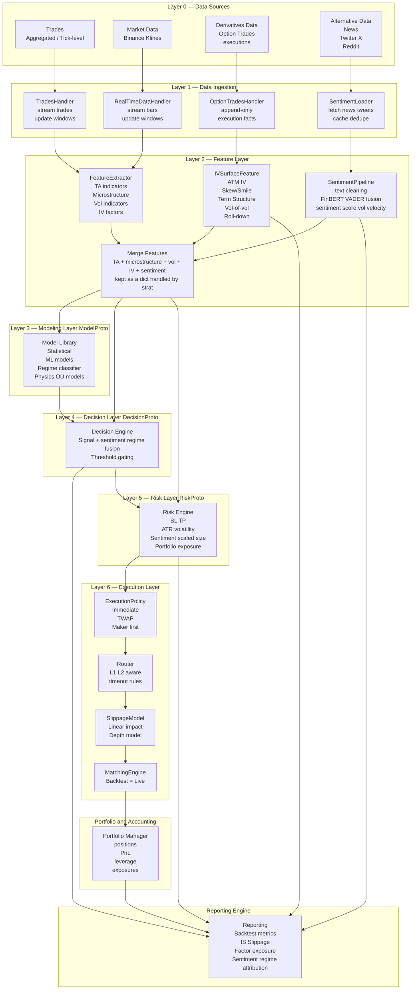

# Overview
Quant Engine (TradeBot v4) is a **contract-driven quant research & execution framework** with **one unified runtime semantics** across:
- **Backtest**
- **Mock (paper) trading**
- **Live trading**

Core idea: components communicate through explicit contracts (Protocols), while the runtime enforces **time/lifecycle correctness** and **execution realism**.

-**Design rules (non-negotiable):**
- **Strategy** = static *template* specification (what to run).  
  No mode, no time, no side effects.  
  Concrete symbols are resolved via an explicit **bind** step.

## Installation

This repo is a **self-contained runtime instance**:
- Runtime data root: `./data/`
- Runtime artifacts root: `./artifacts/`

All filesystem paths are **repo-root anchored** (no current-working-directory dependence).

### Quick start (VPS / Ubuntu 22.04 + Conda)

1) Install Miniconda (or Anaconda). Conda avoids common macOS numpy/pandas binary mismatch issues.
```bash
apt-get update && apt-get install -y curl bzip2
curl -fsSL https://repo.anaconda.com/miniconda/Miniconda3-latest-Linux-x86_64.sh -o /tmp/miniconda.sh
bash /tmp/miniconda.sh -b -p /root/miniconda3
/root/miniconda3/bin/conda init bash
# reopen shell or: source ~/.bashrc
```

2) Install deps (creates/updates conda env, installs repo editable):
```bash
bash scripts/installation.sh
```

3) Activate (default env: `qe`):
```bash
source /root/miniconda3/etc/profile.d/conda.sh
conda activate qe
```

### Alternative (no conda): venv

If you prefer not to use conda:
```bash
cd Quant_Engine
apt-get update && apt-get install -y python3-venv python3-dev build-essential
python3 -m venv .venv
source .venv/bin/activate
pip install -U pip
pip install -r requirements.txt
pip install -e .
python -c "import quant_engine, ingestion; print('imports_ok')"
```

### Notes

- Secrets (API keys, Telegram bot tokens, etc.) must **not** be committed. Keep them on the server (env vars or root-only files).
- Ingestion writes append-only parquet under `./data/raw/...` by design.
- **BoundStrategy** = a fully-instantiated strategy (symbols resolved).  
  This is the only form accepted by the runtime.
- **Engine** = runtime semantics (time, lifecycle, legality).
- **Driver** (BacktestEngine / RealtimeEngine) = time pusher (calls `engine.step()`), strategy-agnostic.

## Event-driven → Contract-driven
Earlier versions relied on implicit control flow between components, which became fragile under multi-source data and execution constraints.

v4 keeps the runtime event-driven, but **logic boundaries are enforced by contracts**:
- `FeatureChannel` → features
- `ModelProto` → scores
- `DecisionProto` → intents
- `RiskProto` → target positions
- `ExecutionPolicy/Router/Slippage/Matching` → fills

## Data Ingestion (Outside Runtime)

Quant Engine v4 **does not include data ingestion in the runtime**.

Ingestion is an **external subsystem** responsible for:
- fetching / listening / replaying data
- normalizing it into ticks
- optionally persisting data (e.g. parquet)

The runtime **never pulls data**.  
It only consumes **already-arrived ticks**.

**Hard boundary:**
```
WORLD → Ingestion → Tick → Driver → Engine → DataHandler → Feature/Model
```
- Ingestion may run in parallel and block on I/O.
- Runtime is single-threaded and time-driven.
- Strategy / Engine / DataHandler never know data sources.

Strategy configs describe **data semantics**, not data provenance.
Ingestion is free to be synchronous or asynchronous; this is intentionally unspecified.

## Strategy loading and runtime control-flow

### Strategy Template → Bind → Runtime

Quant Engine v4 distinguishes **strategy structure** from **strategy instantiation**:

1. **Strategy (template)**  
   Declares data dependencies, feature structure, and model logic using symbolic placeholders  
   (e.g. `{A}`, `{B}` for asset roles).

2. **Bind step**  
   Resolves placeholders into a concrete *universe* (primary / secondary symbols).  
   This step is purely structural and introduces **no runtime or time semantics**.

3. **BoundStrategy**  
   The fully-resolved strategy specification consumed by `StrategyLoader`.

This separation enables clean research semantics, explicit symbol universes, and reproducible execution.


# Time Ownership & Lookahead Safety (v4 Core Invariant)

## Single Source of Time Truth

Quant Engine v4 enforces a **strict single-owner time model**.

Only the **Driver / Runner** (BacktestEngine, RealtimeEngine, MockEngine) is allowed to:
- decide *when* time advances
- decide *which timestamp* is processed next
- control replay speed, ordering, and stopping conditions

All other layers are **time-agnostic**.

| Layer | Knows how time advances? | Responsibility |
|------|--------------------------|----------------|
| Strategy | ❌ | Declare structure and intent only |
| Feature | ❌ (accepts timestamp only) | Snapshot / windowed computation |
| DataHandler | ❌ (on_new_tick / align_to only) | Cache + anti-lookahead |
| StrategyEngine | ❌ (timestamp relay only) | Runtime orchestration |
| **Driver / Runner** | ✅ **Yes** | **Single time authority** |

## Why This Matters: Lookahead Safety

Lookahead bias is not a modeling bug — it is a **time ownership bug**.

In v4:
- No Strategy can pull data
- No Feature can advance time
- No DataHandler can decide *when* new data arrives
- The Engine never infers, guesses, or advances timestamps

Every timestamp used in:
- feature computation
- model prediction
- risk sizing
- execution simulation

originates **exclusively** from the Driver.

This guarantees:
- deterministic backtests
- identical execution semantics across backtest / mock / live
- zero accidental future data access

## Backtest, Mock, Live: Same Engine, Different Drivers

The StrategyEngine is identical across all modes.

What changes is only the Driver:
- BacktestEngine: replays historical ticks
- MockEngine: advances synthetic or delayed real data
- RealtimeEngine: advances wall-clock driven ingestion

Because time ownership is isolated:
- switching modes requires **no strategy changes**
- execution realism is preserved
- research results transfer cleanly to production

> **Invariant:**  
> If a component does not own time, it must never decide or infer time.

---

# How a Market Bar Flows Through the Quant Engine (v4)
At runtime, each new market bar triggers a clean, contract-driven pipeline:

1. Handlers provide the current market snapshot (multi-source)
2. Features are computed and merged into a single feature dict
3. Models output scores
4. Decision + Risk convert scores into a target position
5. Execution layer produces fills (same semantics across backtest/mock/live)
6. Portfolio + reporting update P&L / accounting / traces

Each layer depends **only on contracts**, not implementations.

---

# Minimal Strategy Configuration Example (v4 JSON)
This JSON **only describes runtime assembly (data semantics, features, models)**, and one can save the settings inside the strategy module.

**Data ingestion configuration is intentionally excluded and lives outside the runtime**.

Following is the *runtime assembly config* consumed by `StrategyLoader.from_config(...)`. In practice your real strategies will have more features and data sources; the important part is the **shape** (and the naming convention).

```json
{
  "data": {
    "primary": {
      "ohlcv":        { "$ref": "OHLCV_1M_30D" },
      "trades":       { "$ref": "TRADES_1S" },
      "option_trades":{ "$ref": "OPTION_TRADES_RAW" },
      "iv_surface":   { "$ref": "IV_SURFACE_5M" },
      "sentiment":    { "$ref": "SENTIMENT_BASIC_5M" }
    },
    "secondary": {
      "{B}": {
        "ohlcv": { "$ref": "OHLCV_1M_30D" }
      }
    }
  },

  "features_user": [
    {
      "name": "SPREAD_MODEL_{A}^{B}",
      "type": "SPREAD",
      "symbol": "{A}",
      "params": { "ref": "{B}" }
    },
    {
      "name": "ZSCORE_MODEL_{A}^{B}",
      "type": "ZSCORE",
      "symbol": "{A}",
      "params": { "ref": "{B}", "lookback": 120 }
    },
    {
      "name": "ATR_RISK_{A}",
      "type": "ATR",
      "symbol": "{A}",
      "params": { "window": 14 }
    }
  ],

  "model": {
    "type": "PAIR_ZSCORE",
    "params": {
      "zscore_feature": "ZSCORE_MODEL_{A}^{B}"
    }
  },

  "decision": { "...": "omitted" },
  "risk":     { "...": "omitted" },
  "execution":{ "...": "omitted" },
  "portfolio":{ "...": "omitted" }
}
```
This config does NOT specify data sources, transports, or persistence. Those belong to the ingestion layer.

Notes:
- **Symbols are declared only in `data`** (primary + secondary). Features/models may reference symbols but must not introduce new ones.
- Feature names follow: `TYPE_PURPOSE_SYMBOL` (and if there is a ref: `TYPE_PURPOSE_REF^SYMBOL`).


---

# Minimal Working Example (Python)
### Example 1 — Pair Strategy (A + B)
```python
from quant_engine.strategy.engine import EngineMode
from quant_engine.strategy.loader import StrategyLoader
from quant_engine.backtest.engine import BacktestEngine

from strategies.example_strategy import ExampleStrategy

# 1) define strategy template
strategy_tpl = ExampleStrategy()

# 2) bind concrete universe (no time semantics)
strategy = strategy_tpl.bind(
    A="BTCUSDT",
    B="ETHUSDT",
)

# 3) assembly: BoundStrategy -> StrategyEngine (no time, no ingestion)
engine = StrategyLoader.from_config(
    strategy=strategy,
    mode=EngineMode.BACKTEST,
)

# 4) driver: owns time; ingestion runs externally
# Ingestion is assumed to be running externally and feeding ticks into handlers
BacktestEngine(
    engine=engine,
    start_ts=1640995200.0,   # 2022-01-01 UTC
    end_ts=1672531200.0,     # 2023-01-01 UTC
    warmup_steps=200,
).run()
```
### Example 2 — Single-Asset Strategy (A only, no B)
Some strategies operate on a single asset and do not require a secondary symbol.
This is a valid **B-style degenerate case**, where only `{A}` is bound.
```python
from quant_engine.strategy.engine import EngineMode
from quant_engine.strategy.loader import StrategyLoader
from quant_engine.backtest.engine import BacktestEngine
from strategies.rsi_adx_sideways import RSIADXSidewaysStrategy
# 1) define strategy template (single-asset)
strategy_tpl = RSIADXSidewaysStrategy()
# 2) bind only the primary asset
strategy = strategy_tpl.bind(
    A="BTCUSDT",
)
# 3) assembly: BoundStrategy + mode -> StrategyEngine
engine = StrategyLoader.from_config(
    strategy=strategy,
    mode=EngineMode.BACKTEST,
)
# 4) driver: owns time and execution horizon
BacktestEngine(
    engine=engine,
    start_ts=1640995200.0,
    end_ts=1672531200.0,
    warmup_steps=50,
).run()
```
Notes:
- `{A}`-only binding is a first-class use case.
- Pair / multi-asset strategies simply extend this pattern by introducing `{B}`, `{C}`, etc.
- Strategy structure remains static; only the bound universe changes.
- Time ranges (`start_ts`, `end_ts`, `warmup_steps`) are **driver concerns only**.
- `EngineSpec` carries runtime semantics (mode, primary symbol, universe) but never time.
- Backtest, mock, and live trading share identical execution semantics.
---

# Why This Architectural Shift Matters
It enables the Quant Engine to gracefully support:
- ML-based sentiment regimes
- microstructure-aware execution
- IV-surface-derived features (SABR / SSVI)
- volatility forecasting
- multi-asset & cross-asset strategies
- execution-realistic mock trading
- reproducible backtests with live parity
- research & execution decoupled but interoperable

---

# Full System Architecture Diagram

